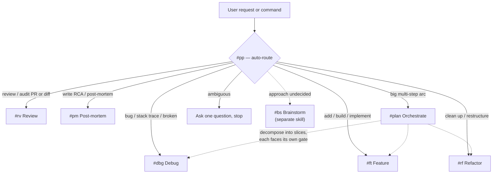
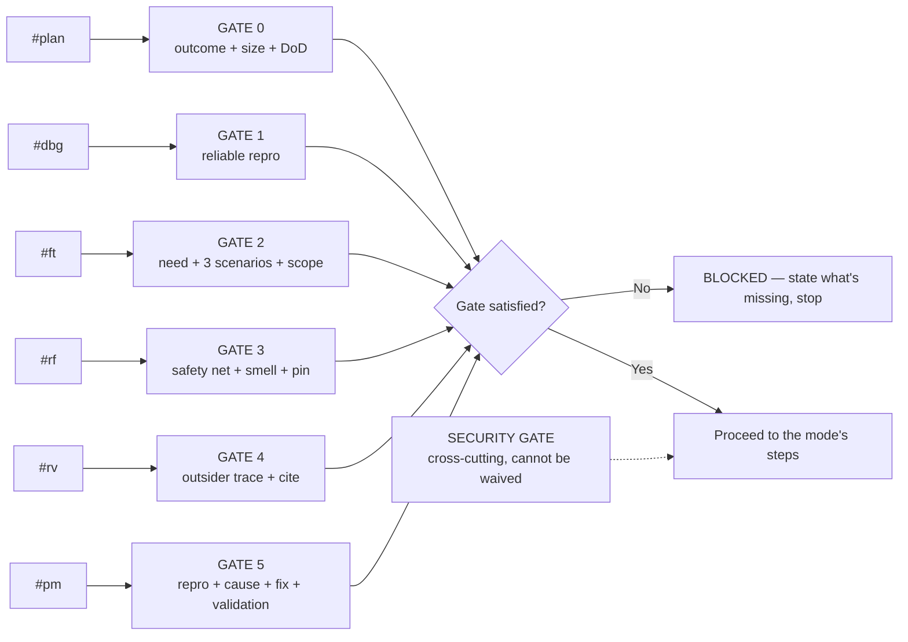
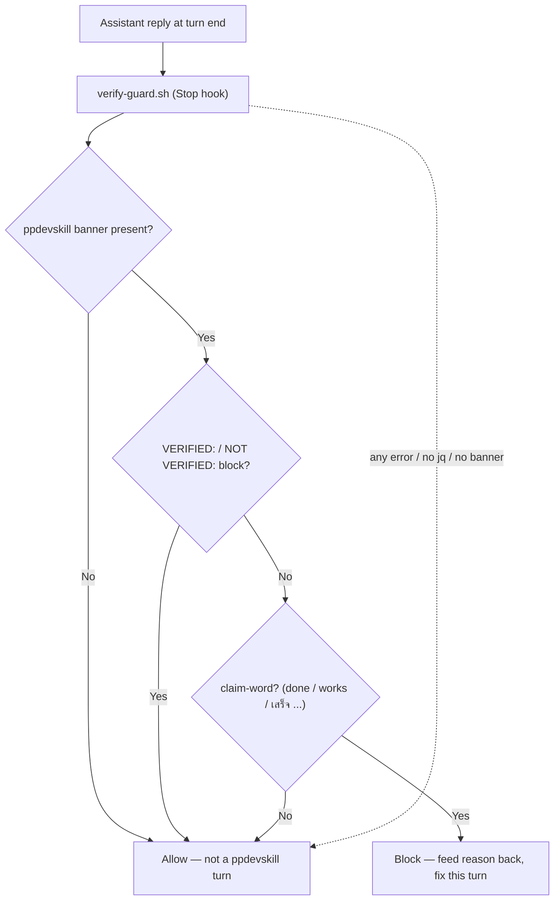
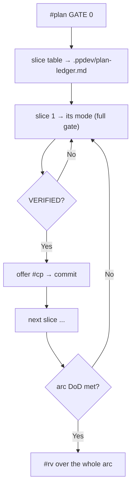

# ppdevskill — Engineering Partner Skill

A Claude skill that turns Claude from *"an AI that throws out throwaway code to finish fast"* into a **real engineering thought-partner** — one that understands the actual need, fixes the right spot, avoids over-engineering, and writes principled code.

> **Language note:** by design, the skill **replies to you in Thai**, keeping technical terms — function names, paths, errors, commands, code — in English. That is why the `examples/` walkthroughs and a few quoted strings below are in Thai: they are not untranslated debt, they are the demonstrated behavior.

---

## What it is

`ppdevskill` is a single skill that unifies the software-engineering workflow into **six modes plus a commit action**. Every mode has a **hard gate** that cannot be skipped — the gate stops Claude from writing code before the information is complete and before you have approved a plan.

The core idea is **zero drift**. LLMs tend to "slip" their rules as a conversation grows longer or as the user grows impatient. This skill forces Claude to follow every rule literally, every time. A user saying *"just do it"* or *"skip the gate"* is **not** authorization to break a rule — the rule is restated and the work stops until the gate is genuinely satisfied.

---

## Modes & commands

| Mode | Command | Use when |
|---|---|---|
| Plan | `#plan` | A big multi-step arc spanning more than one mode or more than 3 slices — orchestrate and decompose |
| Debug | `#dbg` | A bug, an error / stack trace, something broken or throwing |
| Feature | `#ft` | Add / build / implement a new capability |
| Refactor | `#rf` | Clean up / restructure code with **no behavior change** |
| Review | `#rv` | Review / audit a PR, diff, plan, or design doc |
| Post-mortem | `#pm` | Write the RCA / post-mortem after a fix has landed |

Plus two routers and one action:

- **`#pp`** — auto-route: Claude picks the mode from context; if it is ambiguous, it asks one question and stops.
- **`#plan`** — orchestrator: breaks a big arc into slices (ordered by dependency), tags each slice with a mode, then hands off. It **never writes code itself**.
- **`#cp`** — commit / push **action** (not a mode): clean message, no AI attribution, stage only what the change touched. Runs *after* the work is verified.
- **`#bs`** — brainstorm-partner is a **separate skill** the workflow hands off to when the *approach itself* is undecided (it generates and selects, never builds).



---

## The gate model

Each mode opens with a gate. **No gate, no proceed** — if the gate is not satisfied, Claude states exactly what is missing, stops, and waits. Security is a cross-cutting gate that **cannot be waved off**.

- **GATE 0 `#plan`** — outcome stated as an end state + size gate passed + unknowns surfaced + whole-arc definition of done.
- **GATE 1 `#dbg`** — a reliable reproduction exists; no repro → full stop, no hypothesizing.
- **GATE 2 `#ft`** — real need stated + at least 3 given/when/then acceptance scenarios + scope bounded IN/OUT.
- **GATE 3 `#rf`** — a safety net + a concrete motivation (a named smell) + behavior pinned in one sentence.
- **GATE 4 `#rv`** — outsider stance, end-to-end trace, cite `file:line`, no rubber stamps.
- **GATE 5 `#pm`** — repro + root cause + fix + validation all in hand, else refuse.
- **SECURITY GATE (cross-cutting)** — any change touching a trust boundary (input / auth / token / file / SQL / shell / crypto / secret / network / access control / new dependency) trips this gate; the abuse case is written and the relevant OWASP Top 10 items are exercised, not assumed.



---

## VERIFIED discipline + mechanical enforcement

The skill never claims success it has not observed. Any claim-word — *done*, *works*, *complete*, `เสร็จ`, `เรียบร้อย` — must be backed by a `VERIFIED:` block (the actual commands run + their actual output) **immediately above it**. The escape hatch is `NOT VERIFIED:`, which lists every skipped step, the reason, and the concrete checks the user must perform. Static checks (type-check, lint) do not count as verification.

This is not left to willpower. A **Stop hook** (`hooks/verify-guard.sh`) blocks the turn from ending when a ppdevskill response carries a banner and a claim-word but no verification block, and feeds the reason back so the model fixes it in the same turn. It is **self-scoping** (fires only on responses with a ppdevskill banner — other workflows are untouched), **fail-open** (any error → allow; a discipline hook must never brick a session), and catches **Thai claim-words too**.



---

## Ledger — anti-drift persistence

`#plan` / `#dbg` / `#ft` / `#rf` persist their gate state (slice table, hypotheses, scope) to `.ppdev/<mode>-ledger.md` in the working repo, so it **survives context compaction** — Claude re-anchors from the file, not from memory. Add `.ppdev/` to that repo's `.gitignore`.

The ledger is **bounded to one active unit, never append-only**: a new unit overwrites the file, a finished slice is marked `[x]` in place, a replan edits the table in place, and a met definition-of-done clears the file. Steady-state size is one unit's worth (a slice table is ~4–12 rows). If a ledger grows past that, it is being mis-appended — truncate it to the current unit.

---

## Install

**Easiest — via npm:**

```bash
npx ppdevskill@latest install        # copy into ~/.claude/skills/ + ask whether to wire the hook
npx ppdevskill install --with-hook    # wire the Stop hook immediately, no prompt
npx ppdevskill install --no-hook      # don't touch settings.json (prints the snippet to paste)
```

The installer backs up any existing install first, `chmod +x` the hook, and never clobbers unrelated keys in `settings.json`. Restart Claude Code afterward.

**Or git clone:**

```bash
git clone https://github.com/Kamisadev/ppdevskill.git ~/.claude/skills/ppdevskill
```

**Enable the hook manually** (if you used `--no-hook` or cloned): merge `hooks/settings.snippet.json` into `~/.claude/settings.json` (global) or `.claude/settings.json` (per project) — if a `hooks` key already exists, add the `Stop` entry, **do not overwrite**. The hook requires `jq`.

```bash
chmod +x ~/.claude/skills/ppdevskill/hooks/verify-guard.sh
```

File layout:

```
ppdevskill/
├── SKILL.md              # main hub — rules, principles, routing
├── references/
│   ├── plan.md           # GATE 0 + steps for the ultra-plan orchestrator
│   ├── dbg.md            # gate + steps for debug
│   ├── ft.md             # gate + steps for feature
│   ├── rf.md             # gate + steps for refactor
│   ├── rv.md             # gate + steps for review
│   ├── pm.md             # gate + steps for post-mortem
│   ├── sec.md            # security gate (OWASP Top 10)
│   ├── verify.md         # verification recipes per work type
│   └── git-auto.md        # #cp commit / push procedure
├── hooks/
│   ├── verify-guard.sh        # Stop hook — mechanically enforces the VERIFIED block
│   └── settings.snippet.json  # config to merge into settings.json
└── examples/                  # one worked example per mode — read on demand
    ├── plan.md           # ultra-plan example (GATE 0 → slice table)
    ├── dbg.md            # debug example (gate → VERIFIED)
    ├── ft.md             # feature example
    ├── rf.md             # refactor example
    ├── rv.md             # review example
    ├── pm.md             # post-mortem example
    └── cp.md             # commit / push example
```

---

## Usage

Type a mode command in chat, or let the triggers fire on their own. (Realistic input is in Thai — the skill is built for a Thai-replying workflow.)

```
#dbg API /users คืน 500 ตอน login
#ft เพิ่มหน้า export CSV ให้รายงานยอดขาย
#rv ช่วย review PR นี้หน่อย
#pp <describe the task>   ← let Claude pick the mode
```

Claude replies in Thai (technical terms / function names / paths / errors stay English), with a one-line banner stating the mode and gate status on every response, e.g.:

```
> #dbg | GATE 1 PASS | STEP 1.2
```

---

## What it buys you

- **No code from thin air** — no gate, no code; incomplete information means brainstorm first, never guess.
- **Fix the right spot** — find the root cause, don't patch the symptom.
- **No over-engineering** — YAGNI: no abstraction before its time.
- **An honest stance** — no flattery, no hedging, no rubber-stamps; an opinionated recommendation with the tradeoffs.
- **No hollow "it's done"** — every *done / works / เสร็จ* is backed by a `VERIFIED:` block (real commands + real output).
- **Security first** — touching a trust boundary always goes through the security gate (OWASP Top 10), and it cannot be waved off.
- **Enforced by mechanism, not just by asking** — the Stop hook enforces the VERIFIED block; the ledger persists to disk to fight drift in long sessions.
- **Worked examples + an automatic commit offer** — `examples/<mode>.md` shows each mode from gate to VERIFIED block; once work is verified, the skill **offers `#cp`** on its own (never auto-commits, never offers on broken work).
- **Clean separation of concerns** — behavior change and refactor never share a diff; one response, one mode.



---

## Core philosophy

> "ขอเวลาห้านาทีเพื่อทำให้ถูก ดีกว่าทำผิดไปห้าชั่วโมง" — **การปฏิเสธคือฟีเจอร์**
>
> *"Five minutes to get it right beats five hours doing the wrong thing"* — **refusal is a feature.**

Solve the real need, not just the request as typed. When the two diverge, Claude surfaces it and confirms before doing the work.
