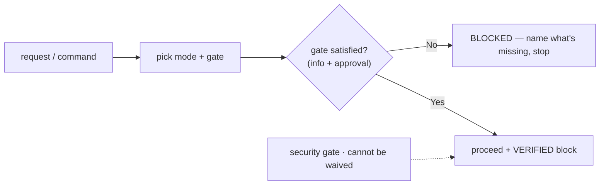
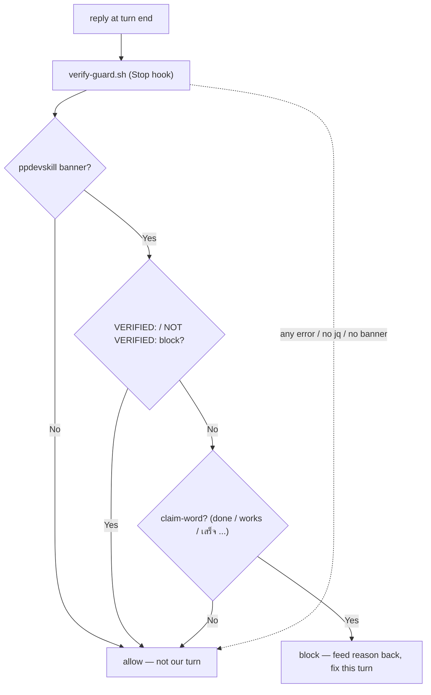

# ppdevskill — your engineering partner, not a code vending machine

[](https://www.npmjs.com/package/ppdevskill)
[](./LICENSE)

> Turn Claude from *"an AI that throws out throwaway code to finish fast"* into a **real engineering thought-partner** — one that understands the actual need, fixes the right spot, refuses to over-engineer, and never says *"it's done"* about something it never ran.

`ppdevskill` is a single [Claude](https://claude.ai/code) skill that unifies the whole software-engineering workflow into **six modes + a commit action**, each guarded by a **hard gate** that cannot be skipped. The gate stops Claude from writing code before the information is complete and before you have approved a plan.

> **Language note:** by design the skill **replies in Thai**, keeping technical terms — function names, paths, errors, commands, code — in English. The technical docs below are English for reach; the demonstrated behavior is Thai.

---

## The problem it solves

LLM coding assistants share three expensive failure modes:

1. **Code from thin air** — they start editing before they understand the need.
2. **"It works" that doesn't** — they claim success they never verified.
3. **Unguarded boundaries** — they touch auth / SQL / file-upload without a threat model.

And a fourth that grows over time: **drift** — the longer the session, the more they "slip" their own rules.

`ppdevskill` attacks all four with **gates, a verification discipline, a mechanical Stop-hook, and an on-disk ledger** — discipline backed by mechanism, not willpower.

---

## Modes & commands

| Mode | Command | Use when | Gate |
|---|---|---|---|
| Plan | `#plan` | A big multi-step arc spanning >1 mode or >3 slices — orchestrate & decompose | GATE 0 · outcome + size + DoD |
| Debug | `#dbg` | A bug, error / stack trace, something broken or throwing | GATE 1 · reliable repro |
| Feature | `#ft` | Add / build / implement a new capability | GATE 2 · need + 3 scenarios + scope |
| Refactor | `#rf` | Clean up / restructure with **no behavior change** | GATE 3 · safety net + smell + pin |
| Review | `#rv` | Review / audit a PR, diff, plan, or design doc | GATE 4 · outsider trace + cite |
| Post-mortem | `#pm` | Write the RCA after a fix has landed | GATE 5 · repro + cause + fix + validation |

Plus: **`#pp`** auto-routes from context · **`#cp`** is the commit/push action (clean message, no AI attribution, runs only after work is verified) · **`#bs`** hands off to a separate brainstorm skill when the *approach itself* is undecided.

**No gate, no proceed.** If the gate is not satisfied, Claude states exactly what is missing, stops, and waits. Security is a **cross-cutting gate that cannot be waved off** — any change touching a trust boundary (input / auth / token / file / SQL / shell / crypto / secret / network / access control / new dependency) trips it, and the abuse case is *exercised, not assumed*.



A user saying *"just do it"* / *"ทำเลย"* / *"trust me"* is **not** authorization to break a rule. The rule is restated and the work stops until the gate is genuinely satisfied. This is the **zero-drift** core.

---

## VERIFIED discipline + mechanical enforcement

The skill never claims success it has not observed. Any claim-word — *done*, *works*, *complete*, `เสร็จ`, `เรียบร้อย` — must be backed by a `VERIFIED:` block (the **actual** commands run + their **actual** output) immediately above it. The escape hatch is `NOT VERIFIED:`, which lists every skipped step, the reason, and the concrete checks you must perform. Static checks (type-check, lint) do **not** count as verification.

This is not left to willpower. A **Stop hook** (`hooks/verify-guard.sh`) blocks the turn from ending when a ppdevskill response carries a banner + a claim-word but no verification block, and feeds the reason back so the model fixes it in the same turn. It is **self-scoping** (fires only on ppdevskill responses — other workflows untouched), **fail-open** (any error → allow; a discipline hook must never brick a session), and catches **Thai claim-words too**.



**Ledger — anti-drift persistence.** `#plan` / `#dbg` / `#ft` / `#rf` persist their gate state (slice table, hypotheses, scope) to `.ppdev/<mode>-ledger.md`, so it **survives context compaction** — Claude re-anchors from the file, not from memory. It is bounded to one active unit (overwrite on a new unit, mark `[x]` in place, clear when done).

---

## Does it actually change anything? (benchmark)

Measured on a 27-trial A/B benchmark — **same model both arms**, identical prompts, with-skill vs without-skill, across all 7 modes + 3 security classes. The skill does not make a weak model smart; it makes a capable model **consistently, mechanically disciplined**.

| Behavior | Without skill | With skill |
|---|---:|---:|
| Wrote code with no plan/approval | **64%** of turns | **0%** |
| Claimed "works/done" without running it | **100%** (2/2) | **0%** |
| Enumerated abuse-cases on a boundary task | **0%** (0/7) | **100%** (6/6) |
| Guessed a root cause before a repro existed | yes | **no** |
| Mixed a bug-fix into a refactor diff | yes | **no** |
| Discipline banner + gate state every reply | 0% | **100%** |

The underrated win is **consistency**: the with-skill arm has near-zero variance; the baseline is disciplined only some of the time, which is exactly what you can't trust in production.

---

## Pros & cons — the honest list

**Pros**

- ✅ **Kills "fake done."** Every claim is backed by real commands + real output, or an explicit `NOT VERIFIED:`.
- ✅ **No code from thin air.** No gate, no code; incomplete info → it asks, never guesses.
- ✅ **Security is non-negotiable.** Trust-boundary changes always go through the OWASP gate, and it cannot be waved off.
- ✅ **Finds the root cause.** Demands a repro before hypothesizing; fixes the cause, not the symptom.
- ✅ **Clean separation.** Behavior change and refactor never share a diff.
- ✅ **Mechanical, not aspirational.** The Stop hook enforces verification; the ledger fights drift in long sessions.
- ✅ **Consistent floor.** Near-zero variance — it behaves the same on turn 50 as on turn 1.
- ✅ **An honest stance.** No flattery, no hedging, no rubber-stamp "LGTM" — an opinionated recommendation with tradeoffs.
- ✅ **Plays nice.** The hook is self-scoping and fail-open: it never touches other workflows and never bricks a session.

**Cons** *(so you can decide with eyes open)*

- ⚠️ **It costs more per turn.** ~1.8× tokens and latency on a *cold* turn (it reads its own rules). This amortizes over a session, but it is real upfront cost.
- ⚠️ **It adds friction to trivial work.** A one-line rename or a throwaway script still meets some ceremony. For spikes / REPL experiments, that friction is not worth it.
- ⚠️ **It replies in Thai by design.** Technical terms stay English, but the prose is Thai. If you need English replies, this is a mismatch.
- ⚠️ **The Stop hook needs `jq`.** No `jq`, the hook fails open (so nothing breaks) but you lose the mechanical net.
- ⚠️ **It pushes back.** It will ask for a repro, acceptance scenarios, or a security abuse-case before writing code. If you just want code *now*, that refusal is friction — by design ("refusal is a feature").
- ⚠️ **Benchmark caveat.** Gains are measured against the *same* model, so the value is *consistency and guarantees*, not raw capability. Multi-turn anti-drift benefits are real but harder to quantify.

**Bottom line:** use it for production code, anything touching auth / payments / data deletion, PR reviews, and long multi-day arcs. Skip it for throwaway scripts and quick learning spikes.

---

## Install

**Easiest — via npm:**

```bash
npx ppdevskill@latest install        # copy into ~/.claude/skills/ + ask whether to wire the hook
npx ppdevskill install --with-hook    # wire the Stop hook immediately, no prompt
npx ppdevskill install --no-hook      # don't touch settings.json (prints the snippet to paste)
```

The installer backs up any existing install, `chmod +x` the hook, and never clobbers unrelated keys in `settings.json`. Restart Claude Code afterward. The hook requires `jq`.

**Or git clone:**

```bash
git clone https://github.com/Kamisadev/ppdevskill.git ~/.claude/skills/ppdevskill
```

---

## Usage

Type a mode command in chat, or let the triggers fire on their own:

```
#dbg API /users คืน 500 ตอน login
#ft เพิ่มหน้า export CSV ให้รายงานยอดขาย
#rv ช่วย review PR นี้หน่อย
#pp <describe the task>   ← let Claude pick the mode
```

Every reply carries a one-line banner stating mode + gate status, e.g. `> #dbg | GATE 1 PASS | STEP 1.2`.

---

## Thank you 🙏 — no strings attached

If you are reading this, you might be about to try this skill — and that already means a lot.

**Even a single download is real encouragement to me.** It tells me this skill is useful to someone out there, and that is the whole reason I keep building it. You don't owe me anything: use it for months on a serious codebase, or just `npx` it once to see how it feels and walk away. Both are completely fine. **No commitment, no lock-in, no pressure.**

> ขอบคุณจริง ๆ สำหรับการดาวน์โหลดและทดลองใช้ครับ 🙏
> แค่ **1 download** ก็เป็นกำลังใจดี ๆ ให้ผมแล้วว่า skill นี้มีประโยชน์ต่อใครสักคน
> จะใช้ยาว ๆ กับงานจริง หรือลองเล่นแล้วเลิกก็ได้ — **ไม่ผูกมัดอะไรทั้งนั้น** ขอบคุณที่ให้โอกาสครับ

If it saved you from one "it works" that didn't, it did its job. ❤️

---

## Core philosophy

> "ขอเวลาห้านาทีเพื่อทำให้ถูก ดีกว่าทำผิดไปห้าชั่วโมง" — **การปฏิเสธคือฟีเจอร์**
>
> *"Five minutes to get it right beats five hours doing the wrong thing"* — **refusal is a feature.**

Solve the real need, not just the request as typed. When the two diverge, Claude surfaces it and confirms before doing the work.
